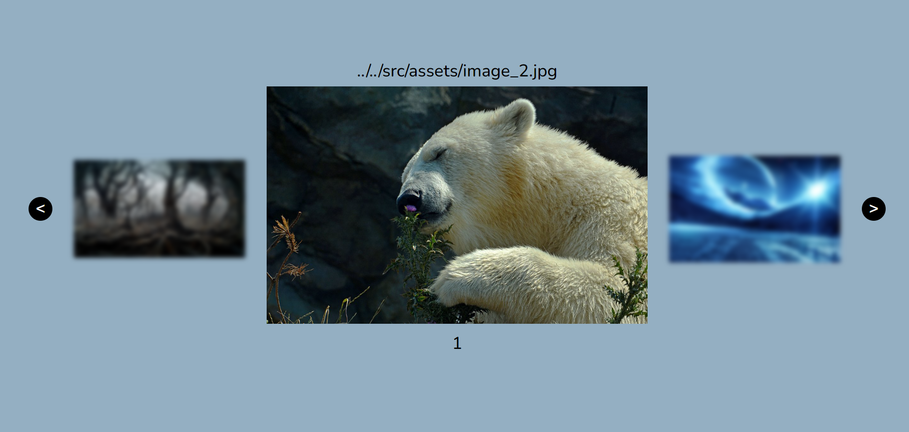

# Hello everyone👋, now I will describe my slider to you.
---

# Image Slider

A simple image slider with previous, current, and next images. This slider displays three images at a time and allows navigation between them using "Previous" and "Next" buttons.

## Features

- Displays a set of images in a slider format.
- Shows the previous, current, and next images.
- Buttons for navigating to the previous and next images.
- Dynamically adjusts visibility of arrows and side images based on the current position.


## Usage
__HTML__
   ```html
   <div class="slider">
        <button id="prev_button">&#60</button>
        
        <div class="middle_image">
            <h1 id="path-img"></h1>
            
            <h2 id="index-img"></h2>
        </div>
        
        <button id="next_button">&#62</button>
    </div>
 ```
__JS__
 ```js script
     const images = [
    '../../src/assets/image_1.jpg',
    '../../src/assets/image_2.jpg',
    '../../src/assets/image_3.jpeg',
    '../../src/assets/image_4.jpg',
    '../../src/assets/image_5.jpg'
    ]

    const prevBtn = document.getElementById('prev_button');
    const nextBtn = document.getElementById('next_button');
    const leftImg = document.getElementById('left-image');
    const sliderImg = document.getElementById('slider-image');
    const rightImg = document.getElementById('right-image');
    const pathImg = document.getElementById('path-img');
    const indexImg = document.getElementById('index-img');

    let currentIndex = 0;

    function updateSlider() {
    const prevIndex = (currentIndex - 1 + images.length) % images.length;
    const nextIndex = (currentIndex + 1) % images.length;
    indexImg.innerText = currentIndex;
    pathImg.innerText = images[currentIndex];
    
    switch (currentIndex) {
        case 0:
        leftImg.style.display = 'none';
        prevBtn.classList.add('inactive');
        break;
        case images.length - 1:
        rightImg.style.display = 'none';
        nextBtn.classList.add('inactive');
        break;
        default:
        leftImg.style.display = 'block';
        prevBtn.classList.remove('inactive');
        rightImg.style.display = 'block';
        nextBtn.classList.remove('inactive');
        break;
    }

    leftImg.src = images[prevIndex];
    sliderImg.src = images[currentIndex];
    rightImg.src = images[nextIndex];
    }

    function changeSlide(direction) {
    currentIndex = (currentIndex + direction + images.length) % images.length;
    updateSlider();
    }

    prevBtn.addEventListener('click', () => changeSlide(-1));
    nextBtn.addEventListener('click', () => changeSlide(1));

    updateSlider();
 ```

## Interface

